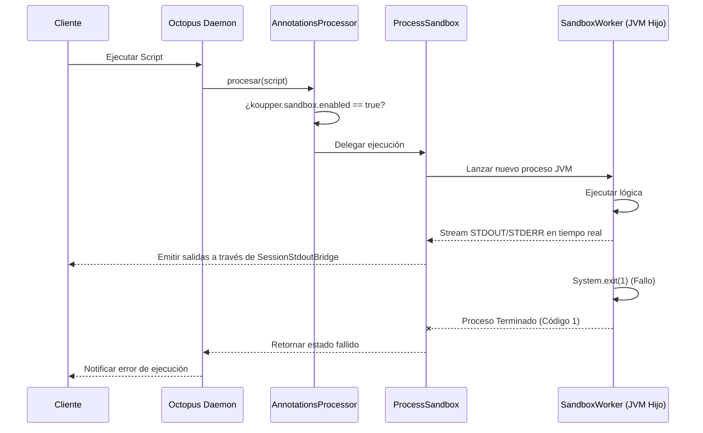
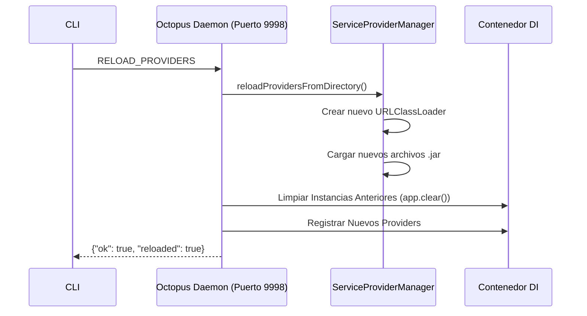

# Arquitectura Koupper v7

Esta documentación describe las mejoras principales arquitectónicas introducidas en la versión 7, centradas en la seguridad, la transmisión en tiempo real y el ciclo de vida de los proveedores (Hot Reloading).

## 1. Process Isolation & Sandboxing

Para prevenir que un script de usuario con código destructivo (como `System.exit()`) afecte el demonio central de Octopus, Koupper v7 utiliza JVM Child Processes (`ProcessBuilder`) para aislar la ejecución.



## 2. Server-Sent Events (SSE) Streaming

El endpoint `POST /api/v1/run-stream` permite la transmisión en tiempo real de los registros de ejecución, conectando la salida interceptada por `SessionStdoutBridge` a un `SseEmitter`.

```mermaid
graph TD
    A[Cliente HTTP] -->|POST /api/v1/run-stream| B(HttpApiServer)
    B -->|Configurar Connection: keep-alive| C{SessionStdoutBridge}
    C -->|Interceptar printLine| D[SSE Writer]
    D -->|emit data: {...}| A
    B -->|Ejecutar| E[ScriptExecutor]
    E -->|println("procesando...")| C
    E -->|Finaliza| F[Cierre del Writer]
    F -->|emit event: done| A
```

## 3. Dynamic Hot-Reloading de Proveedores

Koupper permite la recarga en caliente de extensiones (Service Providers). El demonio puede actualizarse mediante un nuevo `URLClassLoader` para indexar el directorio `~/.koupper/providers` sin detenerse.



---

## 4. Sandbox Parameter Passing (v7.1.1 fix)

El sandbox serializa parámetros como argumentos CLI para el proceso hijo. En v7.1.0, un prefijo `--` causaba un desajuste entre `SandboxWorker` (que escribe `--arg0=valor`) y `parseArgs`/`buildParamsJson` (que buscan `arg0` sin prefijo).

### Flujo corregido (v7.1.1)

```
SandboxWorker (JVM hijo)
  │
  ├─ paramsMap = {"arg0": "{...json...}"}
  ├─ cliArgs = "arg0={...json...}"           ← sin prefijo --
  │
  └─ octopus.runFromScriptFile(params = cliArgs)
       │
       ├─ parseArgs("arg0={...json...}")
       │    └─ params["arg0"] = "{...json...}"   ← key sin --
       │
       └─ buildParamsJson(["SalesReportCommand"], params)
            └─ out["arg0"] = "{...json...}"       ← match correcto
```

### Resolución de tipos inline (v7.1.1)

Para data classes definidas inline en scripts (ej. `SalesReportCommand`), `resolveClassFromArgName` retorna null porque la clase no está en el classpath tradicional. La solución usa el `Type` genérico preservado en la interfaz `FunctionN` del lambda compilado:

```
target.javaClass.genericInterfaces
  └─ Function1<SalesReportCommand, Unit>
       └─ actualTypeArguments[0] = SalesReportCommand
            └─ mapper.typeFactory.constructType(typeArg)
                 └─ mapper.readValue(json, javaType) → SalesReportCommand(...)
```
